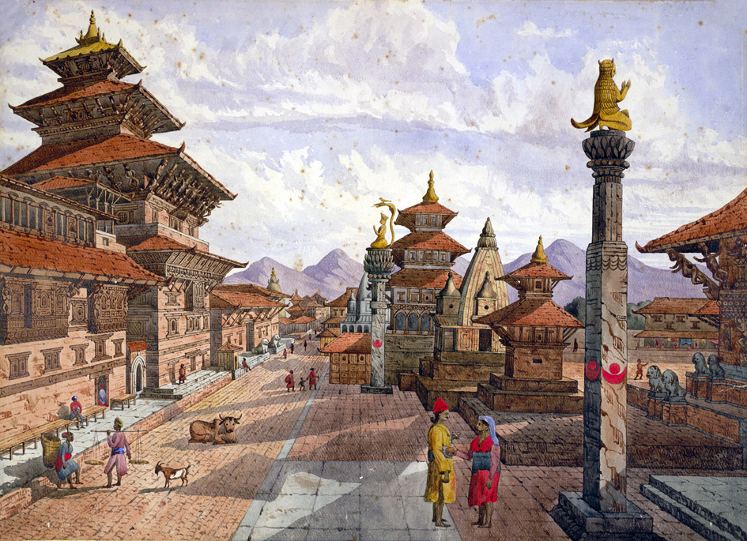


<!-- markdownlint-disable MD013 MD033 -->

# Explore Patan

<div align="center">
  <p><strong>ललितपुर · यल</strong></p>
  <p>A walking guide to Patan's temple courtyards, Newar kitchens, craft lanes, and festival routes.</p>
  <p>
    <a href="https://aalishms.github.io/Explore-Patan/"><strong>Explore the live website</strong></a>
    ·
    <a href="#run-locally">Run locally</a>
  </p>
  <p>
    <a href="https://github.com/AalishMS/Explore-Patan/actions/workflows/actions.yml"></a>
    <a href="https://aalishms.github.io/Explore-Patan/"></a>
  </p>
</div>



Walk from Patan Durbar Square into lanes lined with metal workshops, Buddhist courtyards, neighbourhood cafes, and temples that local craftspeople rebuilt after earthquakes. Explore Patan gathers the city's history and practical stops into one responsive guide.

## Choose a Path

| [History](https://aalishms.github.io/Explore-Patan/#history) | [Places](https://aalishms.github.io/Explore-Patan/#places) | [Food](https://aalishms.github.io/Explore-Patan/#food) | [Festivals](https://aalishms.github.io/Explore-Patan/#calendar) |
| --- | --- | --- | --- |
| Trace Patan from its ancient roots to post-earthquake restoration. | Find six landmarks, from Krishna Mandir to the Ashoka Stupas. | Pick a Newar lunch, courtyard cafe, or museum stop. | Follow the Nepali lunar calendar through eight celebrations. |

## Plan a First Walk

1. Reach Patan Durbar Square early, before the museum courtyards fill.
2. Follow the smaller lanes toward the Golden Temple and stop for a Newar lunch near Mangal Bazaar or Swotha.
3. Choose one afternoon detour: Kumbheshwar, Mahaboudha, or an Ashoka Stupa.
4. Cover shoulders and knees at sacred sites, remove shoes where requested, and ask before photographing people or rituals.

## Inside the Guide

- A six-stop history timeline covering more than 2,000 years
- Landmark cards with practical Google Maps links
- Newar restaurant suggestions and signature dishes
- A respectful first-day walking plan
- Eight festival entries that follow the Nepali calendar
- A photo gallery with keyboard-friendly image viewing
- Section navigation for long-page browsing

<details>
<summary><strong>View the full-page preview</strong></summary>



</details>

## Run Locally

The website has no build step or package dependencies.

```bash
git clone https://github.com/AalishMS/Explore-Patan.git
cd Explore-Patan
```

Open `index.html` in a browser. For a local web server, run:

```bash
python -m http.server 8000
```

Visit <http://localhost:8000>.

## Built With

- Semantic HTML5
- CSS Grid, Flexbox, custom properties, and responsive media queries
- Vanilla JavaScript for navigation and the gallery viewer
- GitHub Actions and GitHub Pages for validation and deployment
- Google Fonts: Yatra One and Mukta

## Accessibility and Performance

The page includes a skip link, semantic landmarks, visible keyboard focus, descriptive image text, and reduced-motion support. Browsers lazy-load off-screen images and fetch the main image first to keep the opening view stable.

[HTMLHint](https://htmlhint.com/) checks each update before GitHub Pages publishes changes from `main`.

## Visitor Notes

Festival dates follow the Nepali lunar calendar and change each year. Use the listed English months as a planning window, then confirm exact dates before travelling. Google Maps links open search results; confirm business hours before setting out.

## Photography

[Wikimedia Commons](https://commons.wikimedia.org/) contributors supplied the landmark, food, and festival photography. [`docs/PROJECT_GUIDELINES_IMPLEMENTATION.md`](docs/PROJECT_GUIDELINES_IMPLEMENTATION.md#external-sources) lists each source.

---

<div align="center">
  <strong>Explore Patan</strong><br>
  Lalitpur, Nepal
</div>
